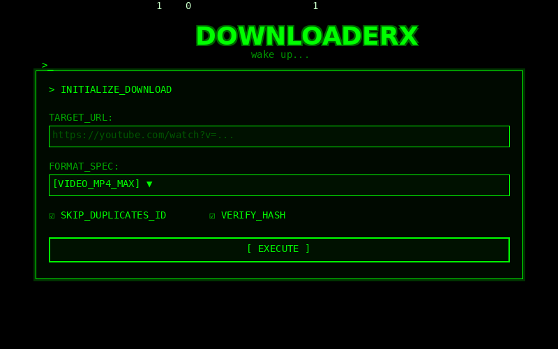

### YouTube DownloaderX

A simple, cross-platform Python script to download YouTube videos in the highest available quality (up to 4K) using the yt-dlp library.



**Prerequisites**

1. **Python 3.x:** Ensure Python is installed on your system.

2. [**FFmpeg:**](https://ffmpeg.org) Required for merging high-quality video and audio streams.

*  **macOS:** Install via Homebrew: ``` brew install ffmpeg ```

*  **Windows:** Download from ffmpeg.org and add the bin folder to your PATH.

**Installation**

Install the required libraries using pip:

```bash
pip install yt-dlp flask
```

**Note:** Flask is only required if you want to use the web interface. For command-line usage, only `yt-dlp` is needed.

### Usage

#### Command Line Interface

1. Run the script:
```bash
python main.py
 ```
2. Paste the YouTube URL when prompted (works with both single videos and playlists).

3. Choose your settings:
   - **Archive Mode**: Skip videos that have already been downloaded (by video ID)
   - **Duplicate Detection**: Compare file hashes to detect identical files with different names

4. Choose your download format:
   - **Video (MP4)** - Best quality video with audio
   - **Audio only (MP3)** - Converted to MP3 format (192 kbps)
   - **Audio only (M4A)** - Original audio quality
   - **Audio only (WAV)** - Lossless audio format

5. The file(s) will be saved automatically in your system's **Downloads** folder.
   - Single videos: Saved directly in Downloads
   - Playlists: Saved in a subfolder named after the playlist
   - Duplicate files: You'll be prompted to delete or keep them

#### Web Interface (Remote Access)

1. Start the web server:
```bash
python web_interface.py
```

2. Open your browser and navigate to:
   - Local access: `http://localhost:5001`
   - Remote access: `http://YOUR_IP:5001` (from another device on the same network)

3. Use the web interface to:
   - Enter YouTube URLs with live thumbnail preview
   - Select format and options via dropdown menus
   - Monitor real-time download progress with Matrix-style UI
   - Stop active downloads with the STOP button
   - View download history

**Features** 

*  **Best Quality:** Automatically selects the best video and audio streams.

*  **Cross-Platform:** Works on Windows and macOS by dynamically resolving file paths.

*  **Auto-Merge:** Uses FFmpeg to provide a single MP4 file for resolutions above 720p.

*  **Archive Mode:** Keeps track of downloaded videos to avoid duplicates.

*  **Duplicate Detection:** Compares file hashes (SHA-256) to detect identical files and prevent redundant downloads.

*  **Remote Web Interface:** Access downloader from any device via browser with real-time progress tracking.

*  **Playlist Support:** Automatically detects and downloads all videos from a playlist link.

*  **Format Selection:** Choose between video (MP4) or audio-only formats (MP3, M4A, WAV).

*  **Real-time Progress Bar:** Visual progress indicator showing download speed, percentage, and ETA.

*  **Download Statistics:** Displays detailed statistics after playlist downloads (success rate, failed items, etc.).

*  **Thumbnail Preview:** See video thumbnail before downloading (web interface).

*  **Matrix Terminal Aesthetic:** CRT scanlines, green terminal theme, animated background.
********************************************************************************************
##  Planned Features

### Core Download Features
- [x] **Archive Mode**: Keep a history of downloaded video IDs to avoid duplicates.
- [x] **Playlist Support**: Automatically detect and download all videos from a playlist link.
- [x] **Format Selection**: Choose between video and multiple audio formats (MP3, M4A, WAV).
- [x] **Real-time Progress Bar**: Display download speed, percentage, and ETA in the terminal.
- [x] **Duplicate Detection**: Compare video hashes and file fingerprints to prevent redundant downloads.
- [x] **Remote Web Interface**: A web-based dashboard for remote download management.
- [ ] **Live Stream Recorder**: Capture ongoing live streams with automatic reconnection on interruption.

### Quality & Format Options
- [ ] **Resolution Picker**: Extract available formats to let users choose specific quality.
- [ ] **Smart Metadata**: Automatically embed thumbnails and media tags into the final file.
- [ ] **Trim/Crop Tool**: Download only specific time segments using FFmpeg parameters.

### Content Management
- [ ] **Custom Folder Selection**: Choose the save location via a system directory picker.
- [ ] **Desktop Notifications**: System-level alerts when a download task is completed.
- [ ] **Cloud Sync (Direct Upload)**: Automated uploading to Google Drive or Dropbox.

### Audio & Video Processing
- [ ] **Noise Reduction**: Apply audio filtering to reduce background noise in downloaded videos.
- [ ] **SponsorBlock**: Integrate API to identify and skip sponsored segments.

### Platform & Integration
- [ ] **Multi-Platform Support**: Extend functionality to support TikTok, Instagram, Twitter, and Vimeo downloads.
- [ ] **Automatic Updates**: Scripted check to ensure dependencies are always up to date.
- [ ] **System Tray Minimization**: Allow the application to run as a background process.
